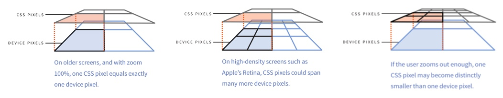
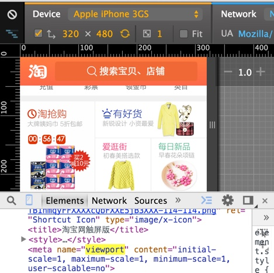
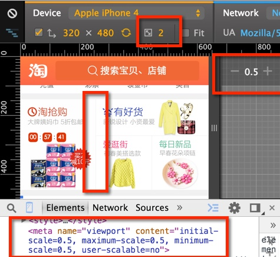
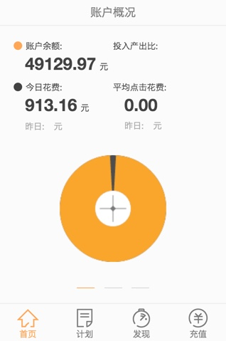
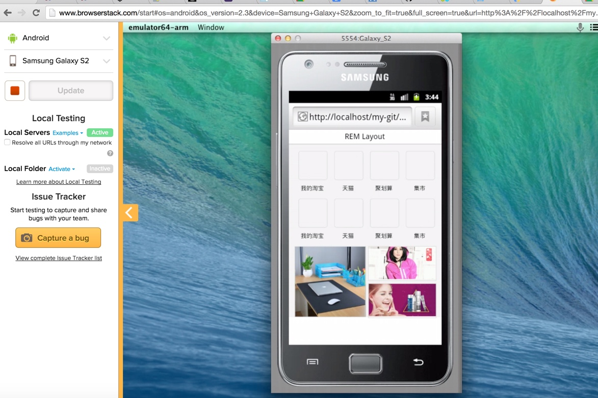

# mobile-layout

## 一、viewport和像素

### 物理像素、CSS像素、独立像素和devicePixelRatio

- 物理像素 device pixel: 物理像素指显示设备上的物理像素点
- CSS像素 css pixel: 指我们写页面时理解的那个像素单位px
- 独立像素dp: （dips device independent pixels）: DP用在Android上，PT用在Apple上
- 衡量设备的物理像素密度 DPI 和 PPI 
	- DPI 指 Dots Per Inch（dpi ldpi mdpi hdpi for android）
	- PPI指 Pixels Per Inch。 
	- [http://dpi.lv/](http://dpi.lv/)
- window.devicePixelRatio = 物理像素/dips(dp) 等效于ddpx
- dppx : device pixel / css pixel;	
- 分辨率（Resolution）：屏幕区域的宽高所占像素数
- [设计师DPI指南](http://www.w3ctech.com/topic/674)

### viewport和devicePixelRatio
 - meta viewport
 	-  width:sets the width of the layout view port to the indicated value. device-width
 	-  initial-scale: sets the initial zoom factor of the page and the width of the layout viewport. 
	-  minimum-scale: sets the minimum zoom level (how much the user can zoom out).
	-  maximum-scale: sets the maximum zoom level (how much the user can zoom in).
	-  user-scalable: prevents user zooming when set to no. This is evil and we will demonstratively ignore it.
 - 使用viewport和devicePixelRatio实现兼容retina屏幕的像素
   
   
   
 - devicePixelRatio测试：http://www.quirksmode.org/m/tests/widthtest_vpdevice.html
 - css中使用devicePixelRatio
 
        .css{
            background-image: url(img_1x.png);
        }
 
        /* 高清显示屏(设备像素比例大于等于2)使用2倍图  */
        @media only screen and (-webkit-min-device-pixel-ratio:2){
            .css{
                background-image: url(img_2x.png);
            }
        }
 
        /* 高清显示屏(设备像素比例大于等于3)使用3倍图  */
        @media only screen and (-webkit-min-device-pixel-ratio:3){
            .css{
                background-image: url(img_3x.png);
            }
        }

 
 
 - vh单位：相对于视口的高度。视口被均分为100单位的vh
 	
  

## 二、REM布局
### rem原理
- 使用相对尺寸的一种，随着页面宽度的改变，html的font改变，控制页面用rem标记元素的尺寸
- 相对于百分比布局，控制局部尺寸更加方便
- 参考 [淘宝无线首页](http://m.taobao.com/)

### [代码](rem/rem.js)

- 需要设置基准元素还有最大的字体元素（防止全屏）
- 核心计算公式
	- 页面宽度：getBoundingClientRect还是width
	- htmlFont = min[pageWidth/(psdWidth/basicFont, maxFont)
- text-size-adjust调整100%
- html font size的设置 拼css完成 而不是document.documentElement.style.fontSize
- 绑定处理 DOMContentLoaded load resize 从未设置viewport的网页进入重新设置一下 pageshow/load persisted(是否后退进入)

### [实战](rem/rem.html)

### 无线团队的lib.flexible
- 1 [代码](https://github.com/amfe/lib.flexible)
- 2 不同点

   - 为了快速兼容vh单位 将布局分为了100份
   - 根据dpr控制meta的值，这样可以保证分别处理不同dpr的样式，但是增加了开发复杂度

## 三、Flexbox盒模型

### 原理

### 版本
  - 2009: http://www.w3.org/TR/2009/WD-css3-flexbox-20090723/
  - 2011: http://www.w3.org/TR/2011/WD-css3-flexbox-20110322/
  - 2015: http://www.w3.org/TR/2014/WD-css-flexbox-1-20140925/
  
  - display: -webkit-box;     
  - display: -moz-box; //2009
  - display: -ms-flexbox;//2011
  - display: -webkit-flex;
  - display: flex; //now
  
### ‘APIS’

- [demo](http://codepen.io/zhangmeng712/pen/pveaxK?editors=110)
- flex type
     
   - display: inline-flex (make element inline-block)
   - display: flex (make element block)

- direction

   - flex-direction:row row-reverse column column
   - box-orient:horizontal vertical

- wrap
     
   - flex-wrap: nowrap | wrap(if not enough place will put content to the next row/column ) | wrap-reverse (should not use in mobile safari)

- flex-flow(direction wrap)
   - flex-flow: row nowrap;

- justify-content(horizontal distribution)
   - justify-content: flex-start | flex-end | center | space-between | space-around;(should not use in mobile safari)
   - horizontal center:
   
         -webkit-box-pack:center;
         -webkit-justify-content:center;
         -ms-flex-pack:center;
         justify-content:center;

- align-items (vertical distribution)
   -  align-items: flex-start | flex-end | center | baseline | stretch
   -  https://developer.mozilla.org/en-US/docs/Web/CSS/align-items

          -webkit-box-align:center;
          -webkit-align-items:center;
          -ms-flex-align:center;
          align-items:center;

- align-self
   - used for flex items to change its align-items
   - align-items used for flex container

- flex-grow flex-shrink

### 兼容性
- [flexbugs](https://github.com/philipwalton/flexbugs)

### [工具](autoprefix/tools.html)

### 实战
- [两栏布局](http://localhost/mbp-new/debug.html#)

  
  
- [复杂布局](flexbox/examples/mix-layout.html)  

  

	
## 四、常见布局-等分和居中

- [demo](basic/layout.html)

## 五、常见布局-图片布局

- background-size
- 图片自适应：padding-bottom
- srcset
- 图片优化（压缩比和Webp）
	- [webp](http://zhitu.tencent.com/) 
	- [淘宝解决方案](http://www.atatech.org/articles/6628)

## 六、代码转化为模板建立解决方案
- [solved by Flexbox](http://philipwalton.github.io/solved-by-flexbox/)
- [demo](index.html)

## 七、其他

- [browserstack](http://www.browserstack.com/)

